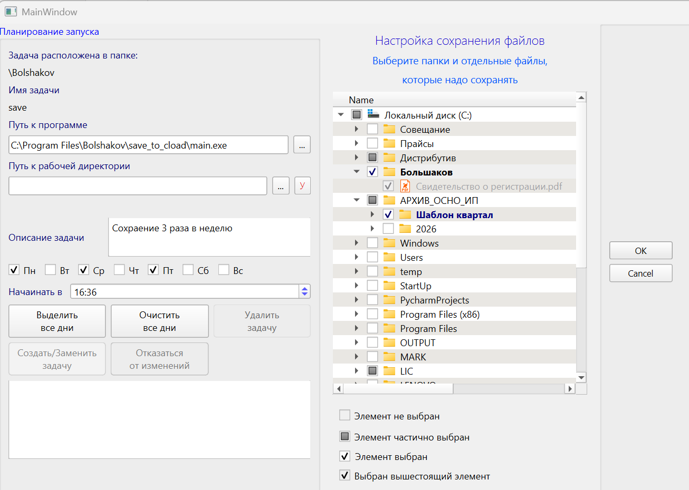

# Save

[Русская версия](README.md)

Save is a Windows-oriented backup utility for creating password-protected archives and uploading them to cloud storage.

The project currently supports 7z as the archiver and Yandex Disk as the cloud storage provider. Its internal structure is designed for future extension, so other archivers and cloud providers can be added later.

## Purpose

The project has two main parts:

1. Automatic creation of a protected archive and upload to the cloud.
2. A graphical setup tool for selecting files, directories, and backup schedule.

Archives are stored in a structured layout on the cloud disk, which makes backup history easier to browse and restore.

## Project Structure

### 1. Backup Runner

The main backup entry point is located in `src/GENERAL/main.py`.

It performs the backup workflow:

- checks required environment settings;
- reads the list of files and directories to back up;
- creates an archive using 7z;
- protects the archive with a password;
- authenticates with Yandex Disk through its API;
- uploads the archive to cloud storage;
- creates and maintains the archive structure on the cloud disk;
- sends an e-mail to the user after the backup finishes.

Related modules:

- `src/ARCHIVES/` - archiver integration, currently 7z;
- `src/YADISK/` - Yandex Disk and OAuth integration;
- `src/GENERAL/` - backup flow, paths, environment variables, archive naming;
- `src/LOGGING/` - logging configuration;
- `src/MAIL/` - e-mail messages and notifications.

### 2. Setup Tool

The graphical setup application is located in `src/SETUP/save_setup.py`.

It prepares the backup configuration:

- selects folders and individual files to back up;
- displays the file system as a tree with selection states;
- saves the selected paths;
- configures a Windows Task Scheduler task;
- allows the user to set weekdays, start time, task description, program path, and working directory.

The setup window contains two main areas:

- Windows task scheduling;
- file and directory selection for backup.

## Setup Window

The setup window screenshot should be stored as `docs/setup-window.png` and displayed in this section.

<!--
After adding the screenshot file to the repository, uncomment the line below:


-->

## Configuration and Secrets

Runtime secrets and sensitive configuration should not be committed to the repository.

The project currently expects required data to be provided externally through:

- environment variables;
- `keyring`;
- local configuration files excluded from Git.

Sensitive files are excluded in `.gitignore`:

- `*.key`;
- `config_secret.json`;
- `token.json`.

The project can be extended later to automate initial setup of secrets, tokens, and environment variables.

## Dependencies

Main dependencies:

- Python;
- 7-Zip;
- PyQt6;
- pywin32;
- requests;
- yadisk;
- keyring;
- python-dotenv;
- pytest.

The full dependency list is available in `requirements.txt`.

## Installation

```bash
python -m venv .venv
.venv\Scripts\activate
pip install -r requirements.txt
```

7-Zip must also be installed and available to the application.

## Running

Run the backup process:

```bash
python -m src.GENERAL.main
```

Run the setup window:

```bash
python -m src.SETUP.save_setup
```

## Building an exe

To run the backup program from Windows Task Scheduler, an executable `exe` file is required.

The BAT file for creating the executable is located in the project root:

```bash
create_exe.bat
```

After building, the path to the generated executable can be selected in the Windows task setup window.

## Testing

The project includes tests for archiving, OAuth, Yandex Disk integration, scheduler logic, logging, and the general backup flow.

```bash
python -m pytest
```

## Roadmap

Possible future improvements:

- automated setup of environment variables and secrets;
- support for additional archivers;
- support for additional cloud storage providers;
- improved graphical setup interface;
- expanded notification scenarios;
- improved build and installation workflow.

## Status

The project is under development. The current implementation targets Windows, 7z, and Yandex Disk.
